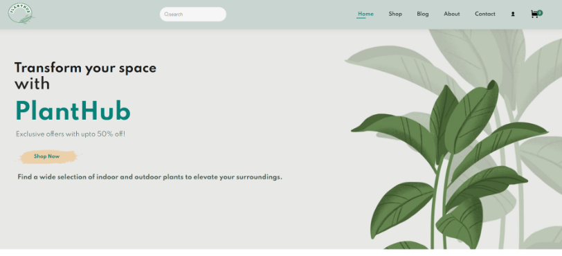
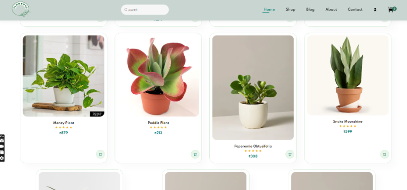
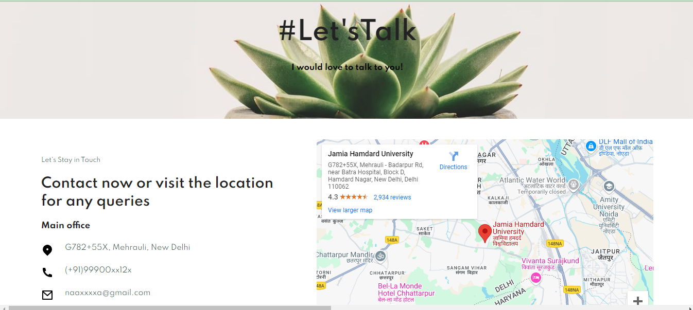
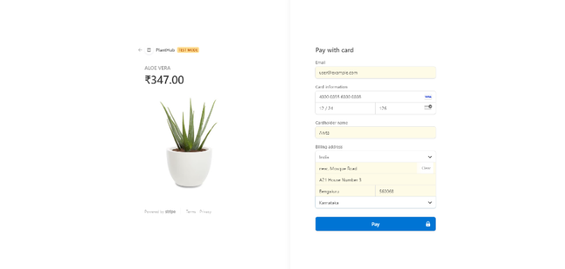
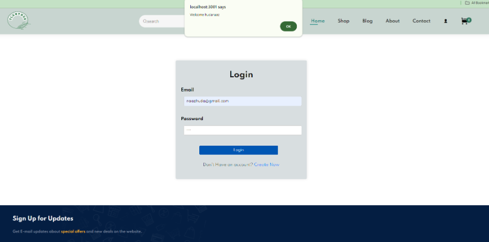

A Responsive Plant Selling E-commerce Website developed using: 
1. Frontend: HTML5, CSS3, and Vanilla Js. 
2. Backend: Nodejs with Express.
3. Payment Gateway: Stripe API Integration. 
4. API Testing: Thunder Client Ext (register, login, and profile authentication testing).  
5. Database: Mongodb (user registeration, login and profile authentication purpose).
6. Authentication: JWT(JSON Web Token)
7. Password Hashing: bcrypt.js








## Documentation
For detailed insights, research methodology, and project analysis, you can view the full dissertation here: [Dissertation PDF](https://drive.google.com/file/d/13A5H2fbPJBJ0irZgQBLXIOsk66yAYcSD/view?usp=drivesdk&usp=embed_facebook&usp=embed_facebook)

## Setup Instructions
Follow these steps to set up:  
```bash 
Refer to the APIs mentioned in the thunderclient.txt file.


