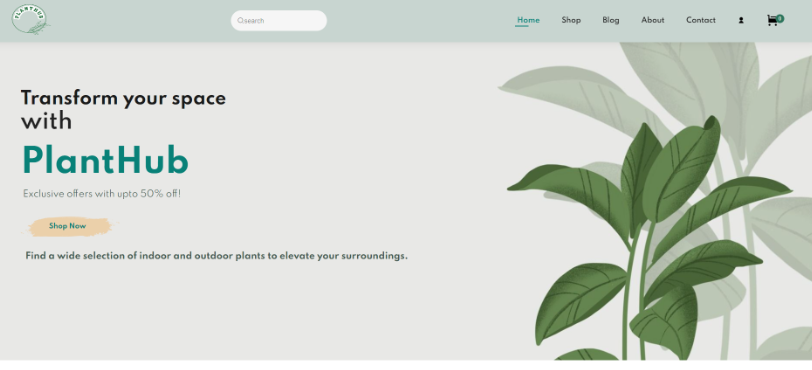
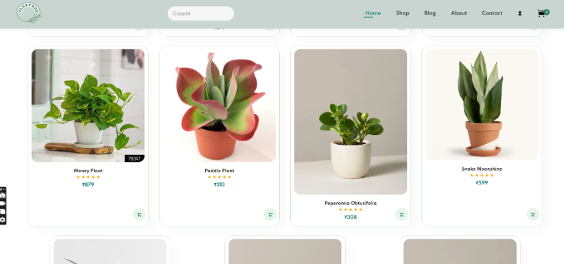
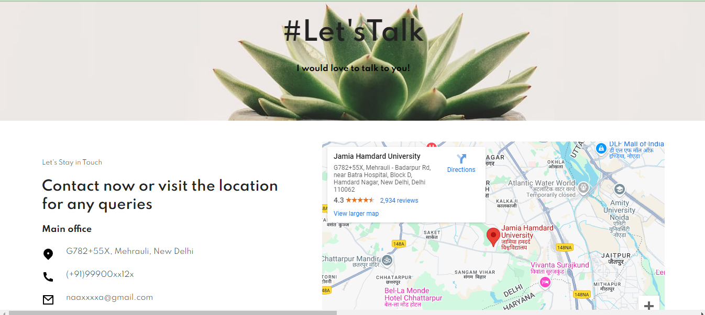
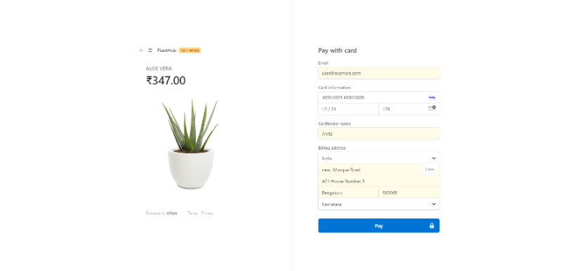
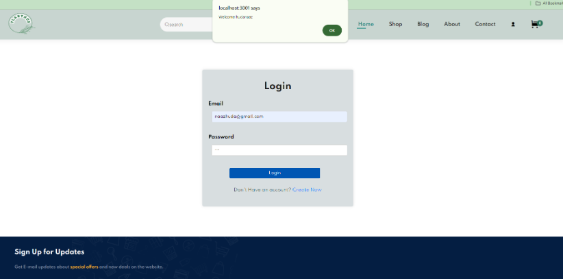

# PlantHub

> A responsive plant e-commerce website built as an undergraduate project. **Perfect for newcomers learning full-stack development** and **experienced developers sharpening real-world skills** through open-source contributions.

[]()
[](./LICENSE)

## 🌱 About

PlantHub is a simple but real e-commerce platform where users can browse plants, add to cart, and checkout using Stripe payments. It demonstrates core full-stack concepts—user auth, payment gateway integration, database persistence, and responsive UI—in a project scope that's manageable for learners while leaving plenty of room for polish and expansion.

**Current Status:** MVP with static product pages and manual layout. **Stage:** Early phase, seeking contributors to help move toward a dynamic catalog system.

## 🛠️ Tech Stack

- **Frontend:** HTML5, CSS3, Vanilla JavaScript  
- **Backend:** Node.js, Express  
- **Database:** MongoDB  
- **Auth:** JWT + bcrypt  
- **Payment Gateway:** Stripe API Integration
- **Testing:** Node test runner  

## 📸 Screenshots







## 🚀 Quick Start

### Prerequisites
- Node.js (v18+)  
- MongoDB (local or Atlas)  
- Stripe test account  

### Setup

1. **Clone & Install**
   ```bash
   npm install
   ```

2. **Create `.env` file with required keys**
   ```bash
   MONGO_URI=your_mongodb_connection_string
   STRIPE_SECRET_KEY=your_stripe_secret_key
   JWT_SECRET=<run command below>
   PORT=3000
   DOMAIN=http://localhost:3000
   ```

3. **Generate JWT Secret** (run once in VS Code terminal)
   ```bash
   node -e "console.log(require('crypto').randomBytes(48).toString('hex'))"
   ```
   Copy output → paste into `JWT_SECRET` in `.env`

4. **Start Dev Server**
   ```bash
   npm run dev
   ```
   Open `http://localhost:3000`

5. **Run Tests**
   ```bash
   npm test
   ```

### Stripe Test Mode (India)

Test payments with this card (test mode only):
- Card: `4000 0035 6000 0008`  
- Expiry: any future date (e.g., `12/34`)  
- CVC: any 3 digits (e.g., `123`)  

## 🤝 Contributing

This project is **actively seeking contributors** at all levels.  

### Who Should Contribute?

- **Beginners:** Learn how real projects are structured; start with documentation or accessibility tasks.  
- **Intermediate:** Improve UI responsiveness, add features, write tests.  
- **Advanced:** Architect the product catalog system, design admin panel, refactor for scalability.  

### Where to Start?

Pick an issue from the list below or [open your own discussion](../../discussions).

---

### 🎯 Quick Wins for New Contributors

These are **great first issues** with clear scope and guidance:

1. **📋 [Create .env.example + Setup Validator](#)**  
   Add an `.env.example` template and a quick startup check script.  

2. **📖 [Write First-Run Setup Guide](#)**  
   Document step-by-step local setup with screenshots/expected outputs.  

3. **🎨 [Fix Responsive Layout Bugs](#)**  
   Mobile/tablet breakpoints for nav, cart, forms. No design decisions needed.  

4. **♿ [Add Basic Accessibility (A11y)](#)**  
   Semantic labels, keyboard navigation, alt text on product images.  

5. **✅ [Cart + Checkout UX Hardening](#)**  
   Add loading states, error messages, empty-cart guard.   


---

### �🛣️ Featured Issues (Mid-Level)

1. **✨ [Show Logged-In User in Header](#)**  
   Display user name/avatar on nav after login; improve logout flow. 

2. **🎭 [Add Open Source Community Files](#)**  
    Contributing guide, issue templates, PR template, code of conduct.

3. **♻️ [Refactor Repeated Layout Components](#)**  
    DRY up header/footer duplication across pages.

4. **🎛️ [Admin Dashboard Scaffold](#)**  
    Foundation for admin plant/product management (CRUD placeholders).

    
---

### � Advanced Issues

1. **[Replace Per-Product Static Pages with Shared Product Data](#)**  
   Remove hardcoded product HTML files and use one reusable product template/renderer.  

2. **[Build Public Products API (Read-Only, Phase 1)](#)**  
   Implement GET /api/products and GET /api/products/:id endpoints for storefront.  

3. **[Add Plant/Product Mongo Schema + Seed Script](#)**  
   Create Product model, define fields (name, price, stock, image, category, etc.), add seeder command.  


---

## 📚 Documentation

- **[Setup Guide](./README.md#-quick-start)** — Getting started locally  
- **[Contributing Guide](./CONTRIBUTING.md)** — How to submit PRs  
- **[API Notes](./thunderclient.txt)** — Auth endpoint examples  

See [Issues](../../issues) for details.

## 📄 License

MIT License — [See LICENSE](./LICENSE)


---

**Happy contributing! 🌿**


